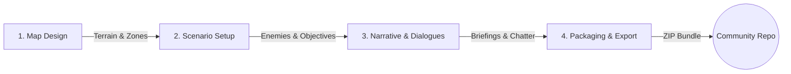

# Modding & Custom Scenarios Guide

Welcome to the **Meridian Strike Content Studio** guide. This comprehensive tutorial will walk you through building your own custom scenario from scratch, packaging it, and publishing it to the Community Repository.

---

## The Scenario Authoring Flow

Creating a complete custom scenario involves four main phases, moving from the physical terrain up through logic, narrative, and finally distribution.

---

## Step 1: Map Design

The first step in any scenario is creating the battlefield. Launch the **Map Editor** from the Content Studio.

### Painting Terrain

You are presented with a blank hexagonal grid (typically 15x15 to 20x20). Use the terrain brushes to paint the environment:

- **Forest:** Grants cover (reducing incoming damage and accuracy) but costs more AP to move through.
- **Crater / Rock Walls:** Block line of sight entirely or provide partial cover for smaller mechs.
- **Elevation:** Use the elevation layers (+1, +2) to create sniper perches and ridges. Mechs firing from higher elevation gain an accuracy bonus.

### Painting Zones

Once the physical layout is complete, you must define logical zones:

- **Deploy Zones:** Paint the hexes where the player can drop their lance.
- **Extraction Zones (Optional):** Paint the hexes the player must reach if the objective is an extraction mission.

> [!TIP]
> Do not scatter terrain randomly. Create deliberate "features" like forest clusters, continuous ridge lines, and clear fire lanes. (See the [Map Design Guide](./MAP_DESIGN_GUIDE) for tactical layout tips).

---

## Step 2: Scenario Setup

With the map saved as `map.json`, switch to the **Scenario Builder** to configure the rules of engagement.

### 1. Victory Conditions

Every scenario needs an objective. You can choose from standard modes like:

- `destroyAll`: Eliminate all enemy units.
- `holdHex`: Defend a specific hex for a set number of rounds.
- `surviveRounds`: Survive an endless onslaught until the turn limit is reached.
- `assassinate`: Destroy a specific high-value enemy target.
- `extract`: Reach the extraction zone by a specific round.

### 2. Turn Limits & Difficulty

Set the maximum number of rounds before the player fails the mission, and define the `massLimit` (maximum drop weight in tons) allowed for the player's lance.

### 3. Enemy Spawn Waves & AI

You must define the opposing force. For each enemy mech, you will assign a chassis, a starting location, a skill level, and an **AI Profile**.

| AI Profile   | Behavior                                                             |
| :----------- | :------------------------------------------------------------------- |
| `aggressive` | Pushes forward to engage at optimal range regardless of cover.       |
| `flank`      | Attempts to circle around to the player's rear arc.                  |
| `sniper`     | Seeks highest elevation and fires from maximum range.                |
| `objective`  | Ignores players to prioritize holding or destroying objective hexes. |

---

## Step 3: Narrative & Dialogues

A great scenario tells a story. Use the **Narrative Composer** to inject life into the battle.

### Briefing Transmissions

Write the pre-drop briefing that the player reads before launching the mission. Set the tone, explain the stakes, and provide hints about the enemy composition.

### In-Combat Radio Chatter

You can set up triggers for in-game dialogue that appear during combat. Triggers can be tied to:

- **Round Start:** (e.g., "Reinforcements arriving on round 3!")
- **Unit Destroyed:** (e.g., The enemy commander shouting when their bodyguard dies)
- **Objective Reached:** (e.g., "The data is secured, get to the extraction zone!")

---

## Step 4: Packaging & Export

Once your map, scenario logic, and narrative are complete, it's time to package them for the community.

### 1. The Package Bundle

A complete scenario is packaged as a standard `.zip` file containing the following:

- `manifest.json` _(Your title, author name, description, and tags)_
- `scenario.json` _(The rules, enemies, and objectives)_
- `map.json` _(The hex terrain grid)_
- `thumbnail.webp` _(A 16:9 screenshot of your map to display in the catalog)_

> [!IMPORTANT]
> The Content Studio will automatically bundle these files for you when you click **Export ZIP**. Do not manually zip the files unless you know what you are doing, as the internal structure must be flat (no sub-folders).

### 2. Publishing to the Community Repository

Once your bundle is exported, it is ready to be sent to the community!

1. From the **Campaign Editor**, click on your scenario to view its details.
2. Click the **Upload** button.

3. The server will run an automated validation check on your package.
4. If successful, your scenario enters the **Pending** queue.

Once an administrator reviews your submission to ensure it meets community guidelines, it will be marked as **Published** and become available for all players to download and play!

For more information on how the approval queue works, see the [Scenario Approval Guide](./SCENARIO_APPROVAL).
