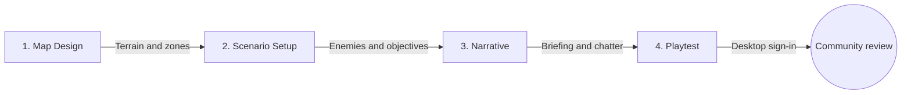

# Custom Scenarios

Meridian Strike **Full Edition** includes in-game tools to design, playtest, and publish scenarios. The Steam demo does not include Custom Scenarios, Campaign Workshop, or the Mercenary Board.

You do **not** upload from this website. Publishing happens in the desktop game after Google sign-in.

---

## Play community scenarios

1. Open **Custom Scenarios** from the title screen, or browse the **Mercenary Board** for approved side contracts.
2. Install from the community catalogue, or import a local ZIP.
3. Play from Custom Scenarios or accept the contract from the Mercenary Board.

Ratings are optional and anonymous. A Netlify outage only blocks community network features; local and official play still work.

---

## Create a scenario

### 1. Map design

Open the **Map Editor** from Content Studio / Custom Scenarios. Paint terrain, then paint **deploy** and optional **extraction** zones. Units and zones must sit on real map hexes or the server will reject the package.

See the [Map Design Guide](./MAP_DESIGN_GUIDE) for layout advice.

### 2. Scenario setup

Configure the objective (`destroyAll`, `holdHex`, `surviveRounds`, `assassinate`, `extract`), turn limit, drop-weight cap, and enemy waves with AI profiles.

### 3. Narrative

Write the pre-drop briefing and optional in-combat radio chatter (round start, unit destroyed, objective reached).

### 4. Playtest locally

Save and play from Custom Scenarios while signed out. Local authoring does not need Google or the internet.

---

## Package rules

The game builds the ZIP for you. Do not hand-zip folders unless you know the layout. A scenario package is a **flat** ZIP:

- `manifest.json` — title, author, description, tags, versions
- `scenario.json` — rules, enemies, objectives
- `map.json` — hex terrain
- `thumbnail.webp` — catalogue image

Limits the server also enforces:

- Compressed ZIP at most 4,000,000 bytes; expanded at most 20 MiB
- Each image at most 1 MiB; PNG, JPEG, or WebP only
- No videos, no nested folders, no reserved official campaign IDs

---

## Publish from the game

1. Use the **Full Edition desktop app** (not the browser hot-reload session, not the demo).
2. Sign in with Google from the community creator panel. The system browser opens; the game never stores a Google client secret.
3. On your scenario card, click **Upload** (or **Update** if it is already linked).
4. The game validates the package, then the server validates it again. On success it enters the **pending** queue. It is **not** public yet.
5. An admin reviews it on the wiki. See [Community Review](./SCENARIO_APPROVAL).

Only the Google account that first published an item can update or withdraw it. Legacy maps that predate ownership cannot be claimed by guessing an email; they stay playable and ownerless until an admin assigns them or you publish a new fork.

